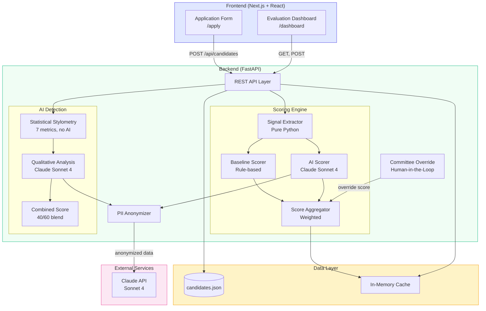

# InVision U — AI-система оценки кандидатов

Интеллектуальная система для приемной комиссии InVision U, которая автоматизирует оценку кандидатов с помощью правил и Claude AI, обеспечивая прозрачность и объяснимость каждого решения.

---

## Архитектура решения



> Полная документация по архитектуре: [docs/architecture.md](docs/architecture.md)

---

## Что делает система

- **Двойное оценивание** — rule-based baseline + Claude AI по 5 измерениям:
  | Измерение | Вес |
  |---|---|
  | Leadership Potential | 25% |
  | Motivation & Values | 25% |
  | Growth Trajectory | 20% |
  | Academic Strength | 15% |
  | Communication | 15% |
- **Детекция AI-эссе** — проверка аутентичности текстов кандидатов
- **Анонимизация PII** — персональные данные удаляются перед отправкой в AI
- **Ранжирование и сравнение** — автоматический рейтинг с возможностью сравнить baseline и AI-оценки
- **Переопределение комиссией** — комиссия может скорректировать баллы по любому измерению
- **Объяснимый AI** — каждый балл сопровождается обоснованием, цитатами из материалов, факторами и замечаниями

---

## Структура проекта

```
.
├── backend/             # FastAPI (Python) — API, scoring, AI
│   ├── main.py          # Точка входа приложения
│   ├── models.py        # Pydantic-модели
│   ├── privacy.py       # Анонимизация PII
│   ├── routers/         # Эндпоинты API
│   │   ├── candidates.py
│   │   ├── scoring.py
│   │   └── analysis.py
│   ├── scoring/         # Логика оценивания
│   │   ├── baseline.py      # Rule-based scoring
│   │   ├── ai_scorer.py     # Claude AI scoring
│   │   ├── ai_detector.py   # Детекция AI-текстов
│   │   └── aggregator.py    # Агрегация и ранжирование
│   └── data/
│       ├── candidates.json      # Синтетический датасет
│       └── generate_data.py     # Генерация данных
├── frontend/            # Next.js — дашборд приемной комиссии
│   └── src/
└── notebooks/           # Jupyter-ноутбуки для анализа
```

---

## Запуск

### Backend

```bash
cd backend
pip install -r requirements.txt
cp .env.example .env  # указать ANTHROPIC_API_KEY
uvicorn backend.main:app --reload
```

API-документация: [http://localhost:8000/docs](http://localhost:8000/docs)

### Frontend

```bash
cd frontend
npm install
npm run dev
```

Дашборд: [http://localhost:3000](http://localhost:3000)

---

## Основные API-эндпоинты

| Метод | Путь | Описание |
|---|---|---|
| `GET` | `/api/candidates/` | Список всех кандидатов |
| `POST` | `/api/scoring/baseline/{id}` | Rule-based оценка |
| `POST` | `/api/scoring/ai/{id}` | Claude AI оценка |
| `POST` | `/api/scoring/rank` | Ранжирование всех кандидатов |
| `GET` | `/api/scoring/compare/{id}` | Сравнение baseline и AI |
| `POST` | `/api/scoring/override` | Корректировка оценки комиссией |
| `POST` | `/api/analysis/ai-detection/{id}` | Проверка аутентичности эссе |

---

## Данные

- `backend/data/candidates.json` — синтетические профили кандидатов: образование, внеучебная деятельность, проекты, эссе, транскрипты интервью, рекомендации
- Реальные персональные данные **не используются**

---

## Технологический стек

**Backend:** Python 3.11+, FastAPI, Anthropic Claude API, Pydantic, scikit-learn, pandas

**Frontend:** Next.js, React, TypeScript, Tailwind CSS

---

## Ограничения

- Кэширование в памяти (без базы данных) — оценки теряются при перезапуске
- Используются только синтетические данные
- CORS открыт для разработки
- AI-оценивание зависит от доступности и стоимости Claude API
- Детекция AI-текстов основана на статистическом анализе

---

## Команда

Rauan Salkenov - Developer
Arman Sagnaev - Product Designer, Illustrator
Aidar Islyamov - UX/UI Designer

