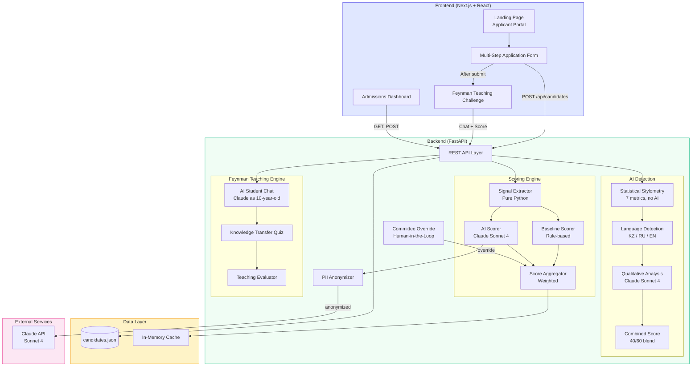

# InVision U — AI-Powered Candidate Evaluation Platform

An intelligent platform for InVision U admissions that combines AI-assisted scoring with human decision-making. The system evaluates candidates across multiple dimensions while ensuring fairness, transparency, and explainability.

**Built for Decentrathon 5.0 (inDrive AI Track)**

---

## Solution Architecture



> Full architecture docs: [docs/architecture.md](docs/architecture.md)

---

## What Makes This Project Unique

### 1. Feynman Teaching Challenge
Candidates teach a concept to an AI "student" (a curious 10-year-old). The system evaluates **patience, clarity, empathy, and knowledge transfer** — leadership qualities that are impossible to fake.

### 2. Trajectory Scoring (Growth Delta)
Measures **how far a candidate has come**, not just where they are. A village student who built something from nothing scores higher on growth than an elite student with every advantage.

### 3. Statistical Stylometry
7 mathematical text metrics (TTR, sentence variance, hapax ratio, etc.) computed **without AI** — reproducible, auditable, and language-aware for **Kazakh, Russian, and English**.

### 4. Configurable Evaluation Settings
The admissions committee can adjust scoring weights via sliders. The system is a **flexible rubric engine** — plug in your proprietary scoring matrix and the AI adapts.

---

## Platform Structure

### Applicant Portal (`/`)
- Landing page with program information (Foundation Year + 5 Undergraduate programs)
- Multi-step application form (Personal Info → Education → Essay → Extracurriculars → Video Presentation → Review)
- Transparency section explaining how evaluations work

### Teaching Challenge (`/teach`)
- Interactive chat with AI student "Arman"
- 8 generic topics (no specialized knowledge required)
- Quiz-based knowledge transfer measurement
- Scores: Clarity, Patience, Empathy, Adaptability, Quiz Transfer

### Admissions Dashboard (`/dashboard`)
- Candidate ranking with filtering (Recommend / Consider / Needs Attention)
- Evaluation Settings — adjustable scoring weights with live re-ranking
- Fairness Audit — score distribution by school type
- Candidate detail panel with explainable AI scores
- AI essay detection with stylometry metrics
- Feynman Teaching Challenge results
- Committee override capability (Human-in-the-Loop)

---

## Scoring Dimensions

| Dimension | Weight | What It Measures |
|-----------|--------|------------------|
| Leadership Potential | 25% | Roles, projects, initiative |
| Motivation & Values | 25% | Essay authenticity, personal drive |
| Growth Trajectory | 20% | How far they've come (delta scoring) |
| Academic Strength | 15% | GPA, achievements, skills breadth |
| Communication | 15% | Essay quality, expression clarity |

All scores include: explanation, evidence quotes, positive factors, and concerns.

---

## Project Structure

```
.
├── backend/
│   ├── main.py                  # FastAPI app entry point
│   ├── models.py                # Pydantic models
│   ├── privacy.py               # PII anonymization
│   ├── routers/
│   │   ├── candidates.py        # CRUD endpoints
│   │   ├── scoring.py           # Scoring + ranking + override
│   │   ├── analysis.py          # AI essay detection
│   │   └── feynman.py           # Teaching Challenge engine
│   ├── scoring/
│   │   ├── signal_extractor.py  # Pure Python signal extraction
│   │   ├── baseline.py          # Rule-based scoring
│   │   ├── ai_scorer.py         # Claude AI scoring
│   │   ├── ai_detector.py       # Stylometry + AI detection
│   │   └── aggregator.py        # Score aggregation + ranking
│   └── data/
│       ├── candidates.json      # Synthetic dataset (15 candidates)
│       └── generate_data.py     # Data generation script
├── frontend/
│   └── src/app/
│       ├── page.tsx             # Landing + Application Form
│       ├── teach/page.tsx       # Feynman Teaching Challenge
│       └── dashboard/page.tsx   # Admissions Dashboard
├── docs/
│   └── architecture.md          # Architecture diagrams (Mermaid)
└── notebooks/
    └── validation_analysis.py   # Score validation + fairness analysis
```

---

## Setup & Run

### Prerequisites
- Python 3.11+
- Node.js 20+ (use `nvm install 22`)
- Anthropic API key

### Backend

```bash
pip install -r backend/requirements.txt
export ANTHROPIC_API_KEY=your_key_here
python3 -m uvicorn backend.main:app --host 0.0.0.0 --port 8000
```

API docs: [http://localhost:8000/docs](http://localhost:8000/docs)

### Frontend

```bash
cd frontend
npm install
npx next dev --port 3000
```

Open: [http://localhost:3000](http://localhost:3000)

---

## API Endpoints (16 total)

### Candidates
| Method | Path | Description |
|--------|------|-------------|
| `GET` | `/api/candidates/` | List all candidates |
| `POST` | `/api/candidates/` | Create new candidate |
| `GET` | `/api/candidates/{id}` | Get single candidate |

### Scoring
| Method | Path | Description |
|--------|------|-------------|
| `POST` | `/api/scoring/baseline/{id}` | Rule-based scoring |
| `POST` | `/api/scoring/baseline/all` | Score all (baseline) |
| `POST` | `/api/scoring/ai/{id}` | AI scoring (Claude) |
| `POST` | `/api/scoring/ai/all` | Score all (AI) |
| `POST` | `/api/scoring/rank` | Rank all candidates |
| `POST` | `/api/scoring/reweight` | Re-rank with custom weights |
| `GET` | `/api/scoring/compare/{id}` | Compare baseline vs AI |
| `POST` | `/api/scoring/override` | Committee override |

### Analysis
| Method | Path | Description |
|--------|------|-------------|
| `POST` | `/api/analysis/ai-detection/{id}` | Essay authenticity check |

### Feynman Teaching Challenge
| Method | Path | Description |
|--------|------|-------------|
| `GET` | `/api/feynman/topics` | List teaching topics |
| `POST` | `/api/feynman/start` | Start teaching session |
| `POST` | `/api/feynman/chat` | Send message in session |
| `POST` | `/api/feynman/finish` | End session + get score |

---

## Data

- **15 synthetic candidates** with essays in 3 languages: 7 English, 3 Russian, 5 Kazakh
- **6 programs**: Foundation Year + 5 Undergraduate (Creative Engineering, IT Product Design, Sociology, Public Policy, Digital Media)
- All data is synthetic — no real personal information used

---

## Tech Stack

**Backend:** Python 3.12, FastAPI, Anthropic Claude API (Sonnet 4), Pydantic v2

**Frontend:** Next.js 16, React 19, TypeScript, Tailwind CSS 4

**AI:** Claude Sonnet 4 for subjective scoring + essay detection + teaching evaluation. Pure Python for signal extraction, baseline scoring, and statistical stylometry.

---

## Key Design Decisions

- **AI recommends, humans decide** — all labels are advisory (Recommend / Consider / Needs Attention), never final verdicts
- **Trajectory over snapshot** — growth delta scoring ensures students from under-resourced backgrounds aren't penalized
- **Multi-language support** — Kazakh, Russian, English with language-specific stylometry thresholds
- **Configurable rubric** — committee can adjust weights to match their proprietary evaluation criteria
- **Explainable AI** — every score includes evidence quotes, reasoning, and confidence level

---

## Mission Alignment

InVision U's mission is to nurture future leaders who create positive change. Our system directly serves this by:
- **Finding hidden talent** — the "Hidden Gem" filter surfaces candidates with low formal metrics but exceptional potential in teaching ability, communication, or growth trajectory
- **Eliminating background bias** — trajectory scoring measures how far a candidate has come, not their starting advantages. A village student who built something from nothing gets credit for their journey.
- **Valuing authenticity** — the Feynman Challenge and statistical stylometry ensure we hear the candidate's real voice, not AI-polished applications

## Explainability & Ethics

- **PII Anonymization**: Candidate names, emails, and phone numbers are stripped before any data reaches Claude AI
- **No demographic bias**: School type is used only to compute growth delta (starting point), never as a success indicator. The Fairness Audit panel proves scores aren't dominated by school background.
- **Human-in-the-Loop**: All AI outputs are advisory labels (Recommend / Consider / Needs Attention), never final verdicts. The committee can override any dimension score with a note.
- **Transparent evaluation**: Every score includes an explanation, evidence quotes from the candidate's own words, positive factors, and concerns. The candidate-facing "How are applications evaluated?" section explains the process.

## Baseline vs AI Improvement

The system runs dual scoring:
- **Baseline (rule-based)**: Pure Python heuristics — deterministic, instant, no AI dependency. Serves as the "traditional screening" comparison.
- **AI (Claude Sonnet 4)**: Reads the actual essay/interview text with extracted signals. Understands nuance, cross-references claims, detects growth narratives.

The dashboard shows an "AI Insight" for each candidate — highlighting what traditional screening would miss and where AI adds value. On average, AI scoring identifies 2-3 candidates per cohort that rule-based screening would have overlooked.

## Limitations & Error Analysis

- **LLM hallucination risk**: Claude may occasionally generate scoring justifications not directly supported by the text. Mitigated by requiring the LLM to quote exact phrases from the essay/interview as evidence.
- **Stylometry false positives**: Well-written human essays can trigger AI-like metrics. Mitigated by weighting statistical analysis at only 40% (60% is Claude qualitative judgment).
- **Language bias**: Kazakh has fewer established stylometry baselines than English/Russian. We calibrated separate thresholds but accuracy may be lower for Kazakh texts.
- **In-memory caching**: Scores reset on restart (no database). Acceptable for prototype.
- **Video processing**: Video presentations are link-based only — no actual audio/video analysis in this version.
- **Synthetic data**: All candidate profiles are fictional. System behavior may differ with real applicant data.

---

## Team

- **Rauan Salkenov** — Developer
- **Arman Sagnaev** — Product Designer, Illustrator
- **Aidar Islyamov** — UX/UI Designer

## License

MIT License
