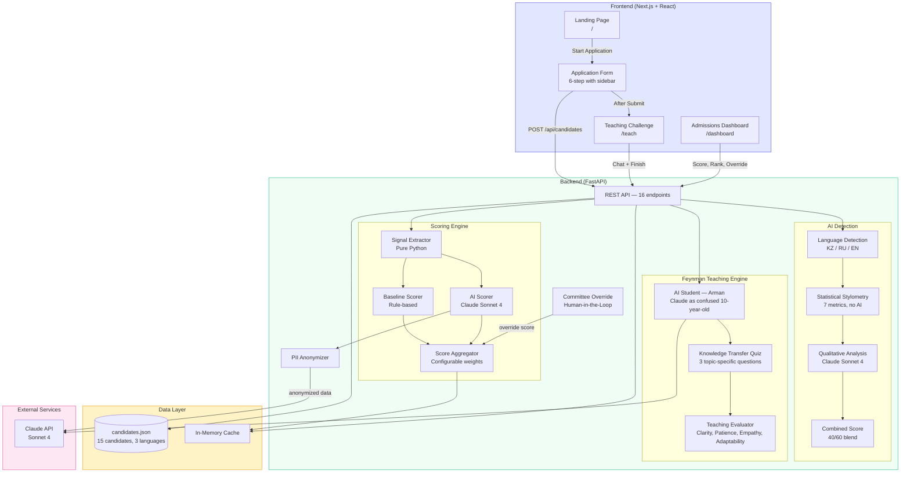
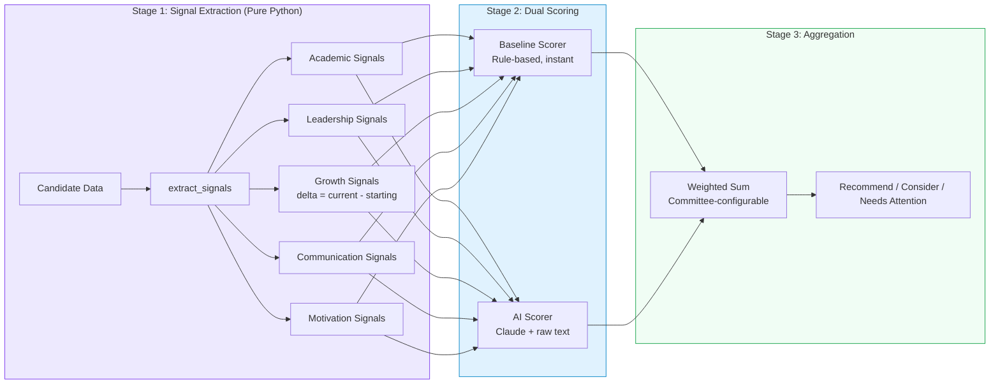
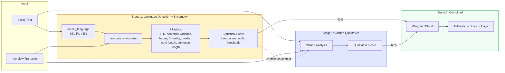
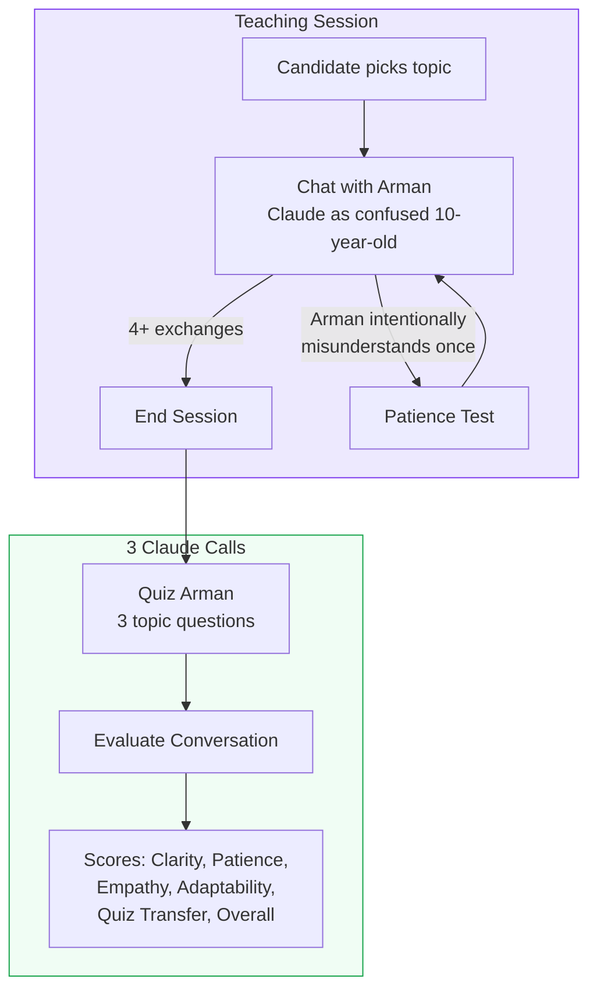
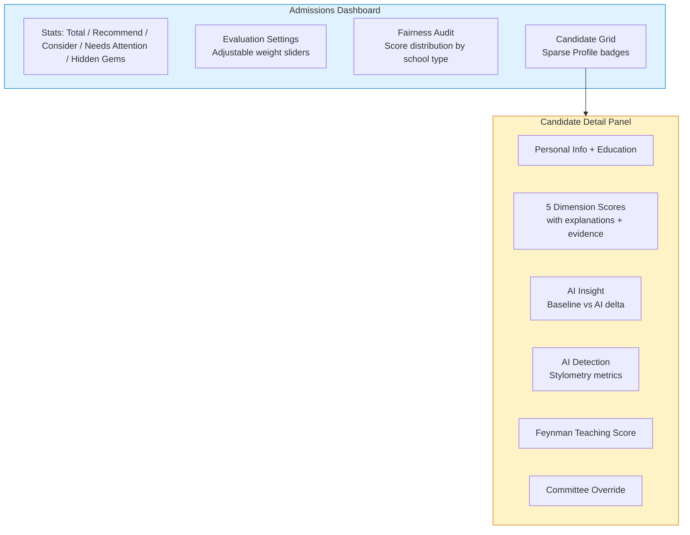
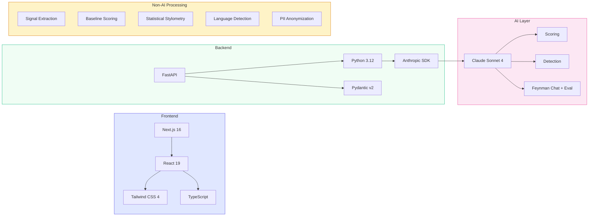

# InVision U — Solution Architecture

## 1. System Architecture

## 2. Applicant Flow

```mermaid
flowchart LR
    subgraph Apply["Application (6 steps)"]
        S1[Personal Info] --> S2[Education]
        S2 --> S3[Essay & Motivation]
        S3 --> S4[Extracurriculars]
        S4 --> S5[Video Presentation]
        S5 --> S6[Review & Submit]
    end

    subgraph Feynman["Teaching Challenge"]
        F1[Pick Topic] --> F2[Chat with Arman]
        F2 --> F3[Arman Takes Quiz]
        F3 --> F4[Get Teaching Score]
    end

    S6 -->|Submit| F1
    F4 --> DONE[Application Complete]

    style Apply fill:#f0fdf4,stroke:#10b981
    style Feynman fill:#ede9fe,stroke:#7c3aed
```

## 3. Scoring Pipeline (3-Stage)

## 4. AI Detection Pipeline

## 5. Feynman Teaching Challenge

## 6. Dashboard Features

## 7. Tech Stack

