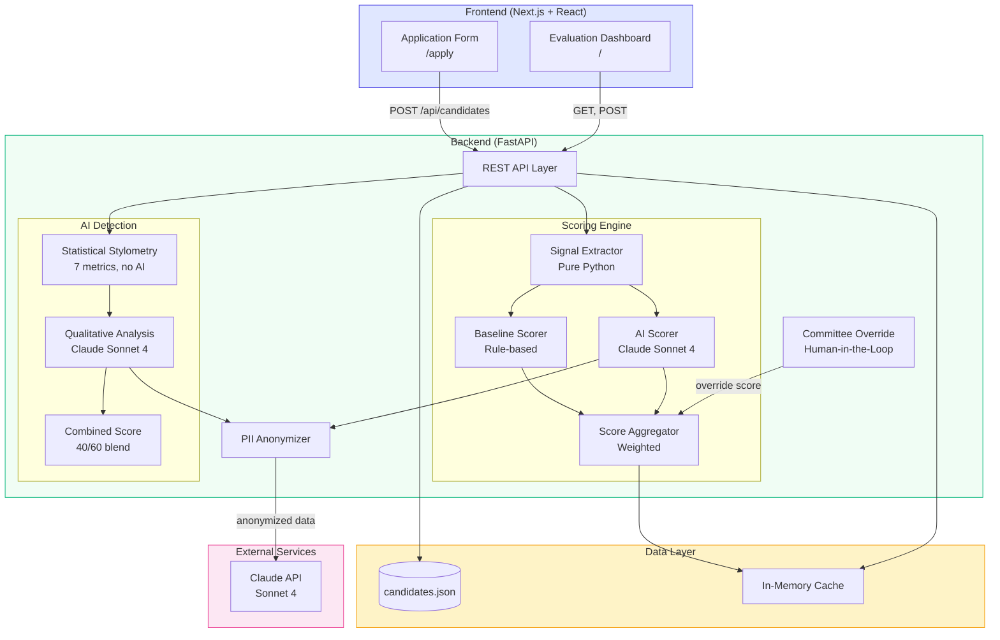
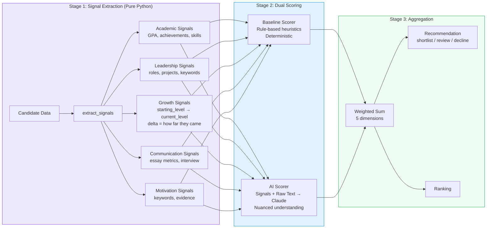
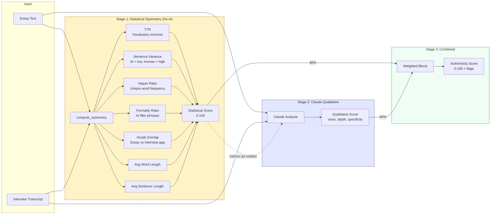
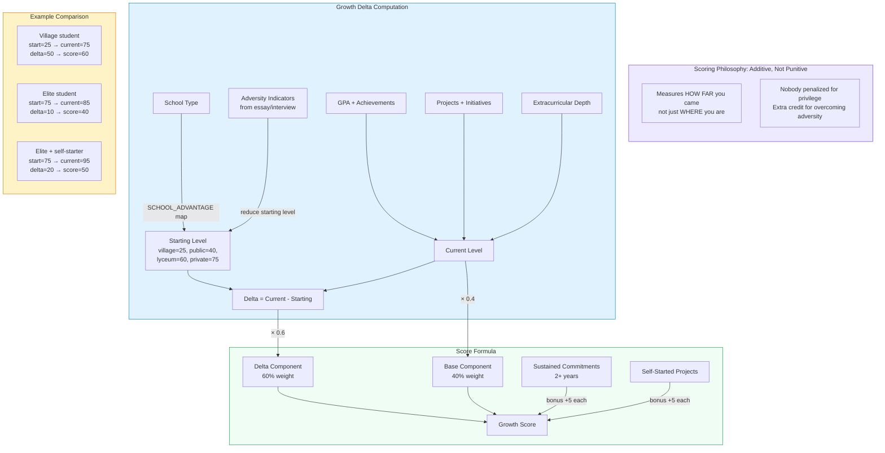
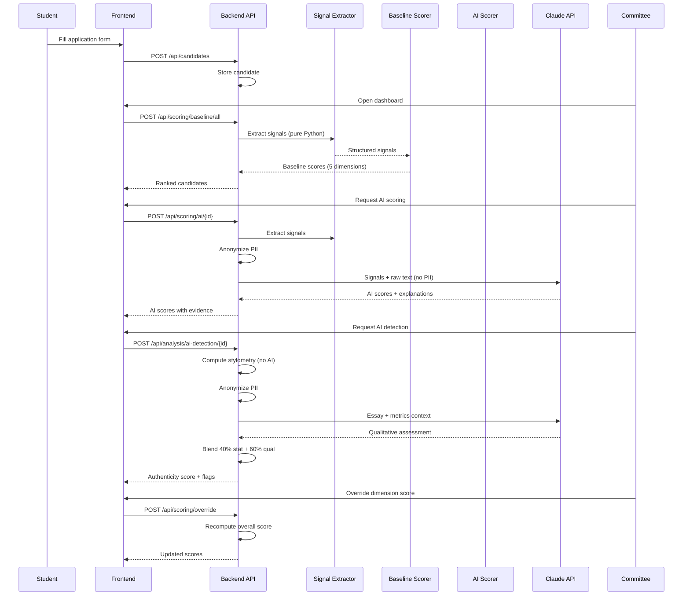
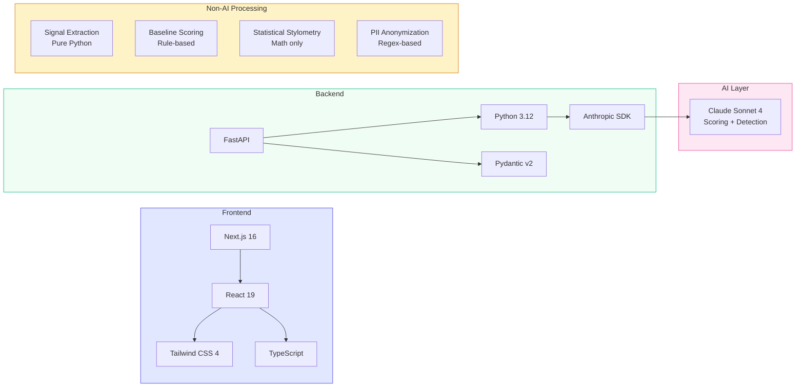

# InVision U — Solution Architecture

## 1. System Architecture (High-Level)

## 2. Scoring Pipeline (3-Stage)

## 3. AI Detection Pipeline

## 4. Trajectory Scoring (Growth Delta)

## 5. Data Flow (End-to-End)

## 6. Tech Stack

